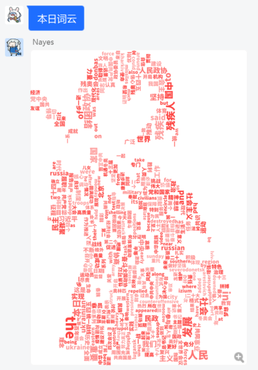

# WordCloud

> 基于 [Mirai Console](https://github.com/mamoe/mirai-console) 的词云生成插件

[](https://github.com/Echoosx/WordCloud/releases)
[](https://github.com/Echoosx/WordCloud/actions/workflows/gradle.yml)

需要安装前置插件 [mirai-hibernate-plugin](https://github.com/cssxsh/mirai-hibernate-plugin)

## 功能
生成当前群的群聊词云（仅限群聊使用）



## 指令
注意: 使用前请确保可以 [在聊天环境执行指令](https://github.com/project-mirai/chat-command)  
带括号的`/`前缀是缺省的  
`<...>`中的是指令名，由`空格`隔开表示其中任一名称都可执行  
`[...]`表示参数，当`[...]`后面带`?`时表示参数可选  
`{...}`表示连续的多个参数


| 指令                   | 描述          |
|:---------------------|:------------|
| `(/)<本日词云 今日词云>` | 生成今日收集到的词云  |
| `/<词云> [yyyy-MM-dd]` | 生成某一日收集到的词云 |

## 配置
### Setting.yml
```yaml
# 设置背景宽度，背景模式为IMAGE时无效
width: 1000

# 设置背景高度，背景模式为IMAGE时无效
height: 1000

# 设置字体大小下限
minFontSize: 30

# 设置字体大小上限
maxFontSize: 100

# 设置词的数量
wordsReturn: 500

# 设置词的最短长度
minWordLength: 2

# 自动过滤匹配的内容，支持正则表达式
removeRegex: 
  - 自定义
  - 屏蔽词汇
  
# 设置词云的背景模式,可选 CIRCLE,RECTANGLE,IMAGE 三种模式
backgroundMode: 'CIRCLE'

# 若背景模式为IMAGE,需要此项来指定背景图片,必须是PNG格式，透明部分不填充文字
# 请填写data/FrameImage目录下放置的图片名称，如:\"default.png\"（可以填多个，生成时则随机选用）
# 生成云图的大小与指定图片相同
imageName: []

# 设置词云选用指定的字体，请填写data/Font/目录下放置的字体文件名，如:\"思源黑体.ttf\"
fontPath: ''

# 设置词云文字可选的颜色,用16进制表示，越靠前的颜色对应的频率越高
colorList:
  - 253DF3
  - 4055F1
  - 408DF1
  - 40AAF1
  - 40C5F1
  
# 文字角度，默认横向与竖向夹杂,值为 HORIZON 只有横向，值为 VERTICAL 只有竖向，值为 RANDOM 角度随机
textAngle: ''
```
## 安装
- 下载安装 [前置插件](https://github.com/cssxsh/mirai-hibernate-plugin/releases/tag/v2.1.1) `jar`包，将其放入工作目录下`plugins`文件夹
- 从 [Releases](https://github.com/Echoosx/WordCloud/releases) 下载`jar`包，也放入`plugins`文件夹
- 如果没有`plugins`文件夹，先运行 [Mirai Console](https://github.com/mamoe/mirai-console) ，会自动生成
